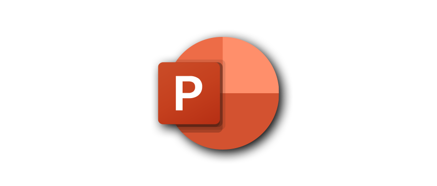

---

title: 如何做出合格的 PPT  
date: 2019-06-16   
updated: 2019-11-26  
categories: 美的设计 
tags: [设计, 工作] 

---

先把 Point 理清楚，再考虑有没有 Power。

<!-- more -->

## 准备工作

### Who

这份 PPT 给谁看？对应考虑配色、文案。

- 商务
- 活泼

### Where

这份 PPT 会在哪里呈现？

- 阅读型（用来看）：文件形式、文件大小、完整数据、详细案例（添加页码）
- 演讲型（用来讲）：投影比例、配色方案、动画、音效、大字报

### When

- 这份 PPT 什么时候要
- 初稿需要什么时间确定
- 是否需要邀请人员参与会议进行讨论商议
- 用于现场演讲的 PPT 是否可以去现场进行彩排演练

## 开始工作

### 逻辑

- 沟通工作
    - 明确老板的要求和 PPT 的目的
    - 重点呈现哪一方面
    - 是否有哪些特别需要指出和强调的关键点
- 寻求同类参考
    - 可以询问老板心目中是否有同类型的资料或者项目可供参考学习
- 建立方案逻辑
    - 使用思维导图或者 Markdown 等各种方便你整理逻辑的工具
    - 百度脑图支持导出和导入 Markdown 文件
- 向上反馈
    - 方案逻辑用脑图的方式向上反馈
    - 需要补充哪些要点

### 内容

每一页 PPT 上面放什么？

- 对应逻辑，将内容「搬进去」
- 注意内容的层级及分类
- 注意内容的精炼：大标题 / 副标题用一句话总结
- 查缺补漏：标记出来，汇总之后，统一解决
- 向上反馈：向甲方第二次确认

### 美化

- 确定风格
    - 套用模板
    - 自己配色、确定辅助图形
- 填充基本内容
- 美化内容
    - 基本原则：亲密、对齐（一个页面只用一种对齐方式）、重复、对比。
    - 少用文字：用视频、图片、图表、图标视觉化文字。
    - 突出重点：字体放大、加重色块、引导图标。
    - 注意留白：页面上下左右均留出一定的页边距，所有的元素、文本、图片不要超出约定范围。

## Tips

### Word（大纲模式）转 PPT

- 1 级标题 PPT 中的新的一页
- 保存并关闭 Word 文档
- 打开 PowerPoint
- 点击 插入 - 新建幻灯片 - 幻灯片（从大纲）

### 版面设置

**行距**
- 1.2 倍 ~ 1.5 倍
- 1.2 倍行距 = 行高是字体大小的 1.2 倍

**字号**
- 投影用：≥ 28.0 号
- 阅读用：≥ 10.5 号

**段间距**
- 约 2 个字高的大小。比如：文字为 12 px，段间距为 24 px

### 主题颜色

使用主题颜色可以随时更改主题颜色，做到全局修改色彩。

- `文字/背景 - 深色 2`：主色
- `文字/背景 - 浅色 2`：对比色 / 强调色
- `着色 1 ~ 着色 6`：图表 / 表格

### [iSlide](https://www.islide.cc/)

简单，好用的 PPT 插件。包含 38 个设计辅助功能，8 大在线资源库以及超 20 万专业 PPT 模板/素材。

### 参考来源

[用好 Keynote 这两个「对齐」工具，幻灯片排版也可以专业有质感 - 包几君Pro](https://sspai.com/post/60316)