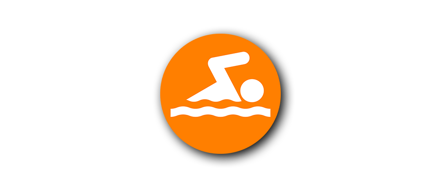

---

title: 游泳入门与蛙泳教学  
date: 2019-07-07   
updated: 2019-07-07  
categories: 生活百科  
tags: 技能

---

换气不顺，游 50 米就没气了，气死我了。

<!-- more -->

## 游泳入门

**准备工作**

- 会游泳的伙伴
- 浮力棒
- 泳镜（因为水压的原因，松紧带不用系太紧；内镜可以涂上唾液，以防生成水雾）
- 泳帽
- 泳衣

**视频教程**

- [游泳入门 by Sikana - YouTube](https://www.youtube.com/playlist?list=PLKvYJEaJ8b1MdwcBYsaEgmSUfLO5ukPpA)
- [如何访问 YouTube](https://tingtalk.me/fq/)

### 克服对水的恐惧

**第一次接触水**

- 首先让脚和双腿接触水，然后让双手和手臂接触水。

**第一次下水**
- 第一次接触水以后，学习将身体一直到胸口浸入水中，可以帮助您在水中感觉更加自在，也可以帮助您之后学习如何在水中行走。

**把头浸入水中**
- 屏住呼吸：用手捏住鼻子。
- 心里清楚知道身体里不会进水：用鼻子和嘴巴吐气和（短时）张开眼睛都不会进水。

**如何恢复站姿**
- 首先水平漂浮在水面，然后双手双腿向内收起，最后恢复站姿。

**如何面朝下漂浮在水面**
- 使用浮力棒练习漂浮，然后不使用浮力棒练习漂浮。

**在水中游动**
- 首先在水面游动，然后在水底游动。

**在深水区游动**
- 首先在浅水区练习，然后借助浮力棒练习游动，最后在深水区练习。

**游过水中的障碍物**
- 游过一个小障碍物，然后游过一个大障碍物。

**跳入水中**
- 坐在泳池边上跳入水中：深吸一口气，低下头，伸手合十于胸前，上身前倾，跳入水中，入水时双腿弯曲。
- 然后借助浮力棒跳入水中。
- 最后不借助浮具跳入水中：入水时双腿弯曲。

### 学习基本的游泳动作

**保持身体竖立头部露出水面**
- 首先练习腿部运动：进入深水区，双水抓在泳池边上，使用蛙泳腿划水。
- 然后练习手部运动：弯曲双腿，双手打水。
- 最后手脚同时运动：保持头部露出水面 10 秒以上。

**仰面漂浮**
- 借助 2 跟浮力棒（置于手臂下）漂浮在水面：抬高骨盆；抬起下巴，目光直视向上；身体放松。
- 借助 1 跟浮力棒（置于腰部）漂浮在水面：像青蛙一下张开四肢，双手和双腿可以小浮动滑水。
- 不借助浮力棒漂浮在水面。

**在水中游进**
- 找到坚实的发力点：池壁或池底。
- 维持推进力：扩大动作幅度。
- 结合不同的发力点：用尽可能少的动作，游更远的距离。

**呼吸**
- 呼气：整个头部浸入水中，同时通过嘴巴（和鼻孔）尽可能地呼出肺部的空气。
- 吸气：头部浮出水面，用**嘴巴**吸气。

**呼吸基础练习**

- 用鼻子呼气（初学者）。
- 同时通过鼻子和嘴巴呼气（能更快地呼出空气）。

**避免呛水**

- 用嘴巴吸气。
- 同时用鼻子和嘴巴呼气。

### 享受泳池的乐趣

**如何在水中倒立**

- 双手撑地，伸直双腿，伸直双臂。

**如何在水下翻跟斗**

- 泳池水位：胸部。
- 调整位置：确保四周没有墙壁；向身体两侧伸直手臂，与水面平行；深吸一口气，下巴紧贴胸部。
- 水下翻跟斗：身体前倾，腿部轻微蹬地，身体弯曲成车轮状，双手划水；一旦学会，尝试连续翻多个跟斗。

**戴脚蹼游泳**

- 需要一块浮板。
- 调整身体在水中的姿势，然后借助浮板游进时腿部的打水动作，不用浮板时双臂的姿势。

**如何使用泳镜和游泳呼吸管**

- 佩戴泳镜（因为水压的原因，松紧带不用系太紧；内镜可以涂上唾液，以防生成水雾）和游泳呼吸管。
- 通过呼吸管呼吸。
- 游泳。

**如何在水中用鸭式潜水法取物**

- 确认物件位置。
- 下潜：深吸一口气，头和手同时进入水中，上半身向前向下倾，双腿伸向高处（与水平面垂直）。
- 拾起物件。
- 最后脚蹬池底回到水面。

**如何前倾入水和后倾入水**

- 前倾入水：蹲下，脚趾钩住泳池边，双手抱住脚踝，下巴紧贴胸口；身体收拢，向前倾倒入水
- 后倾入水：姿势与「前倾入水」相同，但入水要用鼻子呼气。

**螺旋式游泳姿势**

- 先借助浮板练习螺旋式游泳姿势（仰卧式 + 俯卧式）。
- 身体仰卧，双臂伸直于脑后，双腿进行小幅度打水；深吸一口气，换成俯卧式游泳姿势，双臂保持前伸，呼出空气后，再次转换成仰卧的姿势。

## 学习蛙泳

蛙泳与其他游泳姿势不同之处在于手臂和腿部的动作不是同步进行的，同时在游进的时候，腿部比手臂发挥更大的作用。本篇包含以下内容：热身，入水技巧，基本技巧，完善练习，以及运动后的伸展。视频教程参见 [学习蛙泳 by Sikana - YouTube](https://www.youtube.com/playlist?list=PLKvYJEaJ8b1MtJtGhjyvDgFwNCFowLojR)。

### 提前热身

在开始一项体育运动之前，热身（10 分钟）是极为重要的。它可以提高您的身体性能并且降低受伤的风险。

**游泳前上半身热身**

- 骨盆：双手叉腰，臀部顺时针扭动 20 秒，然后逆时针 20 秒。
- 手腕：转动 30 秒。
- 肩膀：双手向前划大圈 30 秒，反方向 30 秒；与此同时，深呼吸。
- 颈部：放松肩部；向左转动半圈，停顿 2 秒；向右重复。

**游泳前下半身热身**

- 脚踝：双脚分开，与骨盆同宽；脚后跟抬高并向前推，脚底保持与地面接触；双脚交替做这个动作。
- 膝盖：并拢双脚和双膝，双手放在膝盖上；双膝弯曲顺时针做划圈运动；反方向来一遍。
- 大腿：身体一侧靠墙，用靠近墙面的腿向前向后踢腿 30 秒；转身，用另一条腿做相同的动作。

### 入水技巧

以下方法可能不适用于公共泳池。

- 瓶式入水：站在池边，身体挺直，大腿和双脚并拢，双臂紧贴躯干；绷直跳入水中；触底时弯曲双腿，然后蹬腿回到水面。
- 坐式入水：坐在池边，双臂高高举起放在脑后，双手前后并拢，手心面向水面；身体向前倾斜，扎入水中时，保持低头的姿势。
- 站立式入水：挺直身体，双腿前后分开，一只脚紧贴在池边，双臂高高举起放在脑后，双手前后并拢，手心面向水面；抬起后面那支脚，身体前倾，扎入水中。

### 基本技巧

**基本游泳动作**

- 入水，双臂自然向前伸直，手指并拢。
- 双臂向两侧张开，向后划水（头部露出水面吸气）至肩部，下巴处合十收手，向前伸展（头部进入水中）
- 弯曲双腿，脚后跟向臀部靠拢；向两边张开双脚；双脚向后蹬水（夹水）产生推进力。
- 双腿，双水伸直，漂一会儿。

**改善手臂划水动作**

- 发力阶段的手臂动作：双臂自然向前伸直，手指并拢；向外划水（划一个大西瓜），此时头部会露出水面；中间状态是手指指向池底；双手（双肩）内收（双肘会触碰到身体两侧），回合至胸部（下巴）的位置。
- 牵引阶段的手臂动作：收紧双肩，双手掌心相对，手指稍稍指向池底，向前伸展。

**改善腿部蹬水动作**

- 仰卧蹬水：双臂各夹一根浮力棒，仰面平躺在水面上；弯曲双腿，脚后跟向臀部靠拢；向两边张开双脚（不要分得太开）；双脚向后蹬水（夹水）产生推进力。
- 俯卧蹬水。双臂各夹一根浮力棒，俯卧水面上；逐步改善腿部蹬水动作。

**手臂和腿部的协调运动**

1. 手臂的牵引动作。
2. 手臂动作结束后，弯曲双腿。
3. 双手和双腿同时伸直。

**改善肩部和头部的入水动作**

- 双腿夹住漂浮板，俯卧在水中。
- 肩部入水动作：肩部尽量保持在水中。
- 头部入水动作：**下巴先进入水中**，然后蹬水。

**转身**

- 触壁：双手以同一高度同时触壁。
- 转身：一只手离开池壁，在水中与池壁相反的方向伸展出去；双腿弯曲（此时的身体是侧躺状）；另一只从空中摆臂，向前进的方向伸展
- 恢复游泳动作。

### 伸展运动

伸展运动可以避免您的肌肉僵硬，同时保持其灵活性。

- 伸展手臂：双臂平举于身体两侧，手指伸直，掌心向下；弯曲手背，手背向着脸颊；保持这个姿势的同时，做 5 组深呼吸循环。
- 伸展腿部：双膝跪地，双手放在双脚后方；臀部向上抬起；持这个姿势的同时，做 5 组深呼吸循环。
- 伸展背部：四肢（膝盖和双手）撑地，深吸气的同时向上抬头，背部自然凹陷；接着深呼气，头部自然下垂，同时背部拱起；重复这组动作 5 次。